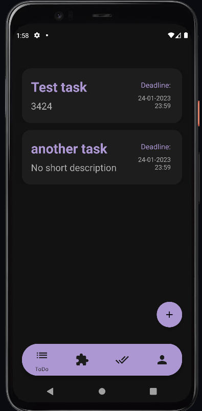
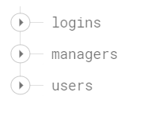

<!--
*** Thanks for checking out the ToDoAPP. If you have a suggestion
*** that would make this better, please fork the repo and create a pull request
*** or simply open an issue with the tag "enhancement".
*** Don't forget to give the project a star!
*** Thanks again! Now go create something AMAZING! :D
-->

<!-- PROJECT LOGO -->
 

  

<h3 align="center">ToDo APP</h3>

  

    Simple app for groups to organize tasks in project.
     
    <a href="https://github.com/mateuszdybich1/ToDoAPP"><strong>Explore the docs »</strong></a>
     
     
    <a href="https://github.com/mateuszdybich1/ToDoAPP">View Demo</a>
    ·
    <a href="https://github.com/mateuszdybich1/ToDoAPP/issues">Report Bug</a>
    ·
    <a href="https://github.com/mateuszdybich1/ToDoAPP/issues">Request Feature</a>
  

<!-- TABLE OF CONTENTS -->

  
Table of Contents

  <ol>
    <li>
      <a href="#about-the-project">About The Project</a>
      <ul>
        <li><a href="#built-with">Built With</a></li>
      </ul>
    </li>
    <li>
      <a href="#getting-started">Getting Started</a>
      <ul>
        <li><a href="#prerequisites">Prerequisites</a></li>
        <li><a href="#installation">Installation</a></li>
      </ul>
    </li>
    <li><a href="#usage">Usage</a></li>
    <li><a href="#roadmap">Roadmap</a></li>
    <li><a href="#contributing">Contributing</a></li>
    <li><a href="#license">License</a></li>
    <li><a href="#contact">Contact</a></li>
    <li><a href="#acknowledgments">Acknowledgments</a></li>
  </ol>

<!-- ABOUT THE PROJECT -->
## About The Project

This project is created for small groups where there is a team leader (manager) and other employees to help them create, manage and  organize tasks. Only team leader can add employee to project, remove employee from project, add tasks and delete them. Regular employee can only start and finish tasks. 

How to use this app:
* After a few seconds of splash screen, user will be taken to the login view. Next, he has to click on the purple text "Sign up now", and will be redirected to the registration view.

    
  
  

  

* User must provide all data, i.e. username, email, password and its repetition. Then decide whether he is the project leader, and click switch button. If all data is unique, then he will be transferred to the view with a 4-digit pin code that
  came to the e-mail address. After entering the code correctly, user will be redirected to
  main view with tasks.

  
  

* After logging in, the user sees 4 sections: "ToDo", "Doing", "Done",
and "Profile". In the "ToDo", "Doing", and "Done" sections, the user sees
task tiles, and can click on a particular task to
view its details, and hold to perform the operation.

  

- "ToDo" - If the user is a leader, he sees a button
  which, when pressed, sees a list with 2 buttons ("Add employee" and "Add task"):

"Add employee" - when leader clicks on this button, he can add employee to project by entering email of employee and clicking button "Add to project".

  

"Add task" - when clicked, user is redirected to the view with fields to fill to add new task for the project. Base deadline date is set to the end of next day.

  

In this section user can start task by holding on task tile and then clicking "Start doing" button. Nickname of user who started task will be assigned to the "Started by" field in task description. Task will be moved to "Doing" section. If user is a manager, he can also delete task by clicking "Delete" button. Regular employee doesn't see this button.

  

* "Doing" - In this section user can see a list of tasks that are in progress. To finish task, user has to hold on task tile and then click "Finish" button. Task will be moved to "Done" section. Nickname of user who finished task will be assigned to the "Finished by" field in task description. If user is a manager, he can also delete task by clicking "Delete" button. Regular employee doesn't see this button.

  
    

- "Done" - In this section you can see a list of all tasks that have been completed
  have been completed. If user is a manager, he can also delete task by clicking "Delete" button after holding on task tile. Regular employee doesn't see this button.

  
    

- "Profile" - User can view information about the account: nickname
  username, email address and leader's nickname. Team members list is available after clicking on "Team list" button. In case of,
  when the user is a leader, he has option to remove
  any employee from the team with the "Remove" button. The second button is
  “Undone Tasks” which does nothing right now, because it isn't finished yet. When the deadline of the task from section "ToDo" or "Doing" have exceeded, task will be moved to the section available after clicking on this button. List will contain tasks which weren't started or finished before the deadline of the task. 

    
    

Database structure:

    
    
    

PHP SMTP API:

    

(<a href="#readme-top">back to top</a>)

### Built With

* [![Next][IntelliJ]][IntelliJ-url]
* [![Next][Kotlin]][Kotlin-url]
* [![Next][PHP]][PHP-url]
* [![Next][Firebase]][Firebase-url]
* [![Next][Material]][Material-url]
* [![Next][Volley]][Volley-url]

(<a href="#readme-top">back to top</a>)

<!-- CONTACT -->
## Contact

Mateusz Dybich  - mateuszdybich1@gmail.com

Project Link: [https://github.com/mateuszdybich1/ToDoAPP ](https://github.com/mateuszdybich1/ToDoAPP )

(<a href="#readme-top">back to top</a>)

<!-- MARKDOWN LINKS & IMAGES -->
<!-- https://www.markdownguide.org/basic-syntax/#reference-style-links -->
[Volley]: https://img.shields.io/badge/Volley-yellow
[Volley-url]: https://google.github.io/volley/
[PHP]: https://img.shields.io/badge/PHP-777BB4?logo=php&logoColor=fff&style=for-the-badge
[PHP-url]: https://www.php.net/
[Material]: https://img.shields.io/badge/Material%20Design-757575?logo=materialdesign&logoColor=fff&style=for-the-badge
[Material-url]: https://m2.material.io/
[Firebase]: https://img.shields.io/badge/Firebase-red?style=for-the-badge&logo=Firebase&logoColor=white
[Firebase-url]: https://firebase.google.com/
[Kotlin]: https://img.shields.io/badge/Kotlin-0095D5?&style=for-the-badge&logo=kotlin&logoColor=white
[Kotlin-url]: https://kotlinlang.org/
[IntelliJ]: https://img.shields.io/badge/IntelliJ_IDEA-000000.svg?style=for-the-badge&logo=intellij-idea&logoColor=white
[IntelliJ-url]: https://www.jetbrains.com/idea/